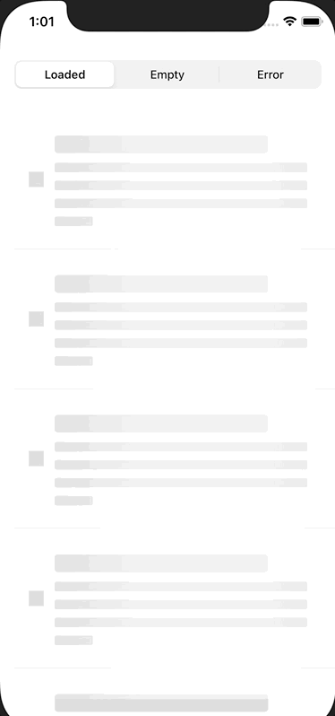

# Shimmer

The package provides a `shimmer` modifier for SwiftUI Views.



## Contents

### shimmer

The `.shimmer` viewModifier will apply a shimmering effect to the modified view:
```
myView.shimmer()
```
It can be optionally configured by providing a `ShimmerConfiguration`

### Loading States

`CollectionLoadingState` is an enum meant to model loadable collections, such as an array of content.  You can transform a Publisher with an Output of a collection into a `Publisher<CollectionLoadingState<Output>, Never>` by using the `mapToLoadingState` function.

### CollectionLoadingView

`CollectionLoadingView` automatically applies transition effects and a default shimmer for a given `CollectionLoadingState`.  See the example project for more details.

## AddingShimmer as a Dependency

To use the Shimmer library in a SwiftPM project, add the following line to the dependencies in your Package.swift file:
```
.package(url: "https://github.com/joshuajhomann/shimmer", from: "1.0.0"),
```

